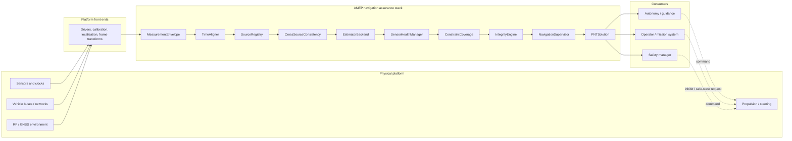
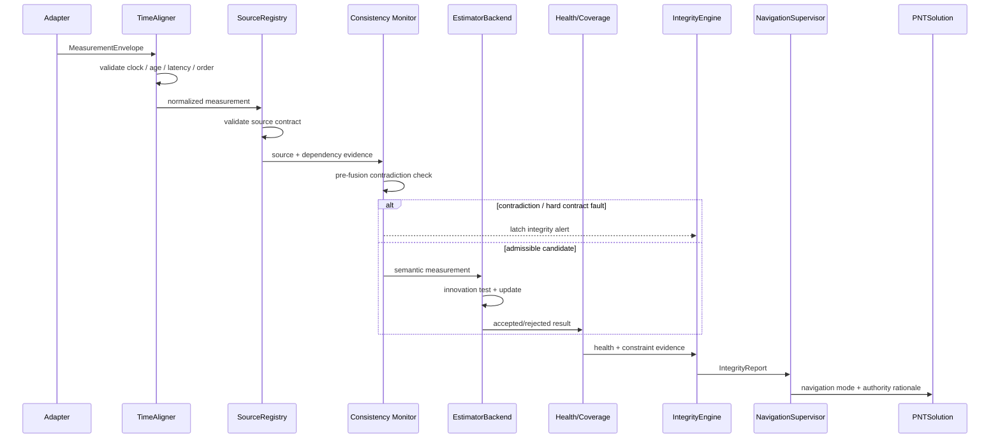

# 01 — System Architecture

## System context

AMEP sits between platform-specific navigation sources and whatever system consumes navigation state and navigation authority. It does not own the vessel, the sensors, the RF environment, the actuator stack, or the collision-avoidance mission logic.



The dashed command paths above are outside AMEP. `SAFE_HOLD` is an authority/state contract. The physical maneuver, station-keeping behavior, propulsion response, and hazard analysis belong to the platform integration.

## Architectural principles

### 1. Preserve provenance through the fusion path

A measurement should not become anonymous once it enters estimation. AMEP preserves source identity, measurement family, covariance, coordinate frame, source timestamp, receive timestamp, clock domain, provenance, sequence metadata, and timestamp uncertainty so downstream decisions can reason about where information came from.

### 2. Separate estimation from integrity

A statistically well-behaved estimator can still be confidently wrong if several sources share a common bias. AMEP therefore treats estimator consistency as one input to integrity, not as integrity itself.

### 3. Model common cause explicitly

Two differently named sensors are not necessarily independent. Shared antennae, receivers, maps, clocks, power rails, compute, calibration, network paths, or environmental effects can create common-cause faults. `SourceRegistry` exists to keep those dependencies visible.

### 4. Make authority a deterministic output

Navigation mode is not inferred informally by downstream code. `NavigationSupervisor` maps current information and integrity status into explicit modes:

- `NOMINAL`
- `GPS_DENIED_RESILIENT`
- `DEGRADED_DEAD_RECKONING`
- `SAFE_HOLD`

### 5. Make evidence reproducible

Online behavior and replay behavior use the same normalized ingestion path. Replay ordering is based on recorded receive time plus sequence, and evidence is bound to behavior-affecting configuration and software identity.

## Layer model

| Layer | Responsibility | Typical engineering owner |
| --- | --- | --- |
| Physical installation | mounts, lever arms, vibration, power, environmental exposure | mechanical / electrical / naval |
| Sensor + bus adapters | decode, calibration, transport, frame conversion, covariance construction | embedded / sensor / software |
| Temporal contract | source/receive time, clock domain, latency, age, ordering | timing / embedded / comms |
| Source dependency model | failure domain, shared dependencies, provenance, safety credit | systems / safety / PNT |
| Cross-source consistency | contradiction detection before state mutation | PNT / integrity |
| Estimator backend | state propagation, measurement update, covariance | PNT / controls |
| Health + coverage | freshness, rejection history, state constraint coverage | PNT / systems |
| Integrity | dependency diversity, contradictions, hard faults, resilient permission | integrity / systems safety |
| Navigation authority | explicit operating mode and veto behavior | autonomy / safety |
| PNT output | state, schema, covariance labels, integrity, age | platform software / autonomy |
| Replay + evidence | deterministic reproduction and configuration binding | V&V / software assurance |

## Current maritime reference estimator

The executable reference model is horizontal and maritime:

```text
x = [E, N, Vw_E, Vw_N, C_E, C_N, psi]^T
```

- `E, N`: local east/north position.
- `Vw_E, Vw_N`: water-relative velocity.
- `C_E, C_N`: estimated surface-current components.
- `psi`: heading.
- ground velocity: `Vg = Vw + C`.

The current backend accepts leveled, gravity-compensated horizontal acceleration and yaw rate. It is not a full strapdown INS and does not contain roll/pitch, gyro-bias, accelerometer-bias, vertical, clock, or lever-arm states.

The architectural seam is `EstimatorBackend`. A platform can replace the reference estimator while retaining timing, dependency, health, integrity, authority, replay, and evidence contracts.

## Online processing sequence



## Physical / software boundary

AMEP cannot infer physical installation quality from software alone. Before a source can be treated as trustworthy, platform engineering must establish the relevant physical facts:

- sensor location and lever arm relative to the chosen reference point;
- boresight / alignment and uncertainty;
- cable, network, and power topology;
- environmental qualification appropriate to the vessel;
- time-source origin and synchronization mechanism;
- calibration identity and validity interval;
- expected transport latency and jitter;
- failure-domain and shared-dependency assumptions.

These are not documentation niceties. They are part of the integrity argument.

## Failure-containment philosophy

AMEP fails conservative at interface boundaries. Examples include rejection of unknown clock domains, invalid timing, unsupported frames, cross-source contradiction, estimator prediction faults, and insufficient integrity evidence for resilient non-GNSS navigation.

The architecture is intentionally skeptical of "more sensors = more safety." Safety credit must be explicit and justified.

## Architecture source of truth

For current implementation details, read:

- [`../ARCHITECTURE.md`](../ARCHITECTURE.md)
- [`../PRODUCTION_HARDENING_2026.md`](../PRODUCTION_HARDENING_2026.md)
- [`../../src/amep1/`](../../src/amep1/)
- [`../../tests/`](../../tests/)

For the frozen research architecture and historical evidence, cite the AMEP-1 Version 1.0 Zenodo record.
