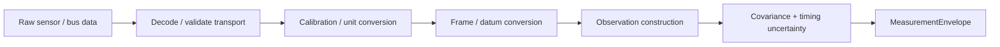

# 03 — Interfaces and Data Contracts

AMEP treats interfaces as engineering contracts, not convenience APIs. Every adapter must make timing, frame, covariance, provenance, and source identity explicit before a measurement can influence navigation state or authority.

## MeasurementEnvelope

`MeasurementEnvelope` is the normalized boundary between platform-specific adapters and AMEP. The contract preserves at least the following concepts:

| Field / concept | Engineering meaning |
| --- | --- |
| source | stable source identity, not merely sensor type |
| kind | semantic measurement family understood by the estimator backend |
| values | estimator-ready observation values |
| covariance | full declared measurement uncertainty |
| frame | coordinate frame of the values |
| source timestamp | time associated with measurement generation |
| receive timestamp | time the platform/runtime observed the record |
| clock domain | identity of the source time base |
| sequence | deterministic equal-time ordering support |
| provenance | adapter / origin evidence required by source policy |
| timestamp uncertainty | uncertainty assigned to temporal alignment |
| metadata | additional adapter facts that must not be hidden in global state |

Raw packets are not estimator-ready merely because they can be parsed.

## Current semantic measurements

The maritime reference backend accepts normalized observations such as:

- local-ENU horizontal position;
- water-relative velocity;
- ground velocity;
- current prior;
- heading.

Raw GNSS sentences, raw radar detections, images, LiDAR clouds, DVL packets, and raw accelerometer specific force require an adapter or localization/calibration front end before they become semantic observations.

## Adapter responsibilities

A platform adapter should do only the transformations it owns and should make those transformations auditable.

An adapter must not:

- fabricate covariance because an API requires a number;
- silently convert between datum or coordinate frames without identifying the transform;
- replace source time with host receive time without preserving both;
- hide shared preprocessing or map dependencies;
- grant itself safety credit;
- bypass `TimeAligner`, source registration, or pre-fusion consistency checks.

## Coordinate frames

The current reference estimator uses local horizontal east/north coordinates derived from WGS 84 around a configured origin. A platform integration must document:

- authoritative geodetic datum;
- local navigation frame and origin;
- body-frame axis convention;
- heading/yaw convention and wrap interval;
- vertical datum if vertical information is introduced;
- location of the navigation reference point on the vessel;
- sensor lever arms and boresights;
- transform ownership and uncertainty.

A frame name is insufficient without a convention.

## Timing contract

The interface preserves both source and receive timestamps because they answer different questions.

- **source time:** when the sensor or upstream process says the measurement applies;
- **receive time:** when the navigation runtime received the record;
- **clock domain:** which time base produced the source timestamp;
- **timestamp uncertainty:** how uncertain the alignment is.

`TimeAligner` rejects unknown clocks, excessive latency/age, excessive future skew, and out-of-order samples under configured policy. Clock offsets and uncertainty values are engineering inputs; they are not proof of synchronized hardware.

## SourceRegistry

Every source is described separately from the estimator. A source descriptor can encode:

- source role / class;
- whether it is an absolute-position source;
- whether it is GNSS-derived;
- primary failure domain;
- shared dependency tokens;
- expected clock domain;
- provenance requirement;
- maximum timestamp uncertainty;
- whether the integration grants safety credit.

Safety credit is opt-in. The research reference profile grants none because a real vehicle dependency analysis and timing/provenance contract have not been validated.

## EstimatorBackend contract

`EstimatorBackend` decouples the surrounding assurance architecture from a particular state vector. A backend owns:

- state layout;
- state dimension;
- prediction-input type;
- process/dynamics model;
- accepted semantic measurement kinds;
- accepted coordinate frames;
- observation models;
- covariance update behavior;
- estimator-specific validation.

It publishes an `EstimatorSnapshot` containing a `state_schema_id` and ordered `covariance_labels` so covariance is never exposed as an unlabeled matrix.

## PNTSolution contract

`PNTSolution` is intended to tell downstream consumers not only what the navigation estimate is, but what is known about it. The contract includes concepts such as:

- coordinate frame;
- position and ground velocity;
- heading;
- optional backend-specific water velocity/current;
- state schema and labeled covariance;
- configured containment probability;
- covariance-derived horizontal containment proxy;
- protection-bound availability/validation state;
- source health and age-of-data;
- constraint coverage;
- integrity state;
- navigation mode and rationale.

The current design explicitly reports that a validated horizontal protection bound is unavailable.

## Interface Control Document expectations

For every real source, create an ICD entry containing at minimum:

| Topic | Required definition |
| --- | --- |
| physical source | make/model/configuration and mounting location |
| transport | electrical/network/bus protocol and framing |
| units | raw and normalized units |
| coordinate frame | axis definition and datum |
| timestamp | field origin, clock domain, epoch, rollover/reset behavior |
| latency | expected distribution and maximum allowed |
| uncertainty | measurement covariance construction and calibration source |
| provenance | identity of adapter/calibration/configuration |
| failure behavior | stale, frozen, corrupt, disconnected, restarted, delayed |
| dependencies | clock, antenna, power, map, network, compute, calibration |
| safety credit | yes/no and engineering justification |
| verification | tests proving the contract at the real interface |

## Rejection is a valid outcome

A strong integration does not force every record through the filter. Contract rejection, pre-fusion contradiction, and innovation rejection are distinct outcomes and should remain separately observable in logs and replay.

## Delayed measurements

The deterministic real-time reference estimator does not rewind state for delayed observations. Delayed radar/vision/bathymetry/calibration workloads belong behind the explicit delayed-measurement backend seam, such as a fixed-lag smoother or factor-graph implementation. Adding such a backend must not silently remove the independently runnable real-time navigation path.
