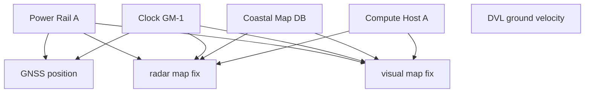

# 05 — Timing, Communications, and Failure Domains

Navigation integrity depends on time and dependency structure as much as on sensor accuracy. A measurement with the right value at the wrong time can be wrong. Two agreeing measurements that share the same failure chain can be one piece of information wearing two names.

## Time is part of every measurement

AMEP preserves four distinct temporal concepts:

- **source timestamp** — when the source says the observation applies;
- **receive timestamp** — when the navigation runtime receives the observation;
- **clock domain** — the time base that produced source time;
- **timestamp uncertainty** — uncertainty assigned to that temporal relationship.

These fields allow AMEP to reject impossible or unsupported timing before estimation.

## TimeAligner responsibilities

`TimeAligner` can enforce policy for:

- known/declared clock domains;
- clock normalization;
- transport latency;
- measurement age;
- future skew;
- per-source ordering.

The ingestion path uses a two-phase align/commit approach so a record that fails a downstream contract does not incorrectly advance the ordering watermark for that source.

Configured clock offsets are not a time-synchronization system. A real vessel integration must identify the physical synchronization mechanism and measure its uncertainty.

## Why replay uses receive order

Different sensors may report source time from different clock domains. Sorting a multisensor recording globally by raw source timestamps can create an order that never existed online.

AMEP deterministic replay therefore uses:

```text
recorded receive time + explicit sequence
```

for processing order. Source timestamps remain inside each `MeasurementEnvelope` and are normalized by the same `TimeAligner` used online.

This preserves the distinction between:

- event arrival order;
- measurement applicability time;
- normalized navigation time.

## Clock-domain engineering checklist

For every source, document:

- oscillator / clock source;
- synchronization mechanism;
- epoch and representation;
- rollover behavior;
- reset / reboot behavior;
- monotonicity guarantees;
- transport timestamp location;
- hardware versus software timestamping;
- expected offset and drift;
- uncertainty budget;
- behavior during sync loss.

If the source cannot meet its declared timing contract, the correct outcome is degraded or rejected data, not silent timestamp repair.

## Communications supervision

`CommunicationsSupervisor` is intentionally narrow. It performs deterministic selection among declared links using priority and heartbeat freshness. It rejects invalid/non-finite timestamps, non-monotonic heartbeat behavior, and future-dated heartbeats.

It does **not** provide:

- RF modem control;
- networking stacks;
- encryption or authentication;
- anti-jam waveforms;
- network intrusion detection;
- bandwidth/QoS guarantees;
- RF propagation modeling;
- remote-operation certification.

Those belong to the communications and cybersecurity architecture.

## Link state versus navigation state

A healthy communications link does not imply a healthy navigation solution, and a healthy navigation solution does not imply a communications link exists. AMEP keeps those concerns separate so command authority can reason about both.

Typical system questions include:

- Can an operator command be trusted and delivered if the primary BLOS link is down?
- If all command links are lost but navigation remains sound, what autonomous authority is permitted by the platform safety case?
- If navigation integrity is lost while communications remain healthy, should the operator retain limited manual authority or should the safety system constrain motion?

AMEP exposes navigation mode and communications freshness, but the final vessel behavior is platform policy.

## Failure domains

A failure domain represents a mechanism by which multiple sources may fail together.

Examples include:

- shared GNSS antenna or receiver;
- common RF interference environment;
- shared map / chart database;
- common localization front end;
- shared clock or PTP grandmaster;
- common network switch;
- common power converter or rail;
- shared compute process or host;
- shared calibration file;
- shared environmental model;
- common operator input;
- common software defect.

`SourceRegistry` supports a primary failure domain plus additional shared dependency tokens.

## Example dependency graph



In this example, radar and vision are different sensing modalities but may share a map, clock, compute host, and power domain. Treating them as fully independent because one uses radar and the other uses a camera would overstate resilience.

## Safety credit

Safety credit is an explicit integration decision, not a property inferred from sensor type.

The current research profile grants no safety credit because the repository does not contain a validated vehicle-specific dependency graph, provenance contract, or measured timing budget.

A source considered for safety credit should have:

- documented provenance;
- finite timestamp-uncertainty limit;
- reviewed dependency chain;
- real-interface verification;
- credible failure behavior;
- validation against the fault hypotheses for which it is credited.

## GNSS denial and RF-health information

AMEP is designed for GNSS-degraded and GNSS-denied research, but it does not equate "GNSS unavailable" with "GNSS spoofed" or "receiver jammed." Those are different hypotheses.

Useful future integration evidence may include receiver metrics, RF-monitor outputs, antenna status, clock behavior, or other observables, but those must enter through explicit source contracts and be validated before they affect integrity policy.

## Timing and common-cause test campaign

A serious integration should inject at least:

- fixed clock offset;
- drifting clock offset;
- timestamp jumps;
- source reset / epoch discontinuity;
- future timestamps;
- stale/frozen samples;
- variable transport delay;
- packet reordering;
- duplicated records;
- shared clock failure across multiple sources;
- shared network congestion;
- common power interruption;
- map/service outage affecting multiple localization sources.

The objective is not merely to keep the software running. The objective is to verify that the correct sources lose credit and the correct navigation authority is withdrawn.
