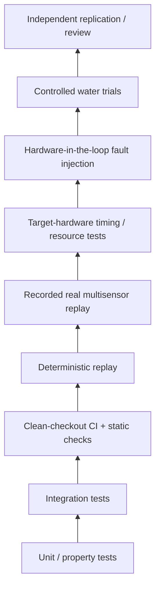

# 06 — Verification and Evidence

AMEP uses an evidence ladder. The central rule is simple: **evidence only supports claims at the layer where it was produced.**

A passing unit test does not prove real-sensor behavior. A software-in-the-loop result does not prove target-compute timing. HIL does not prove open-water performance. A covariance calculation does not become a protection level because it is conservative in one simulation.

## Evidence ladder



Higher layers do not make lower layers unnecessary; they test different failure mechanisms.

## Current software evidence

The repository currently exercises software contracts around areas including:

- maritime state propagation and measurement updates;
- heading-sensitive propagation Jacobian behavior;
- rejection of inappropriate raw inertial input at the reference estimator boundary;
- innovation gating;
- covariance stability/PSD behavior;
- sensor freshness, isolation, and recovery policy;
- normalized timing contracts;
- source dependency and cross-source consistency behavior;
- constraint coverage and navigation-mode transitions;
- communications freshness/failover support;
- host-SIL timing observation;
- fail-closed runtime behavior;
- deterministic replay and evidence semantics.

CI is intentionally treated as software evidence only. The exact test count is not a maturity metric and may change as coverage expands.

## Current research evidence

The frozen AMEP-1 Version 1.0 research record contains both positive and negative findings.

### Supported within the disclosed synthetic/SIL scope

- WGS 84 local geometry implementation consistency against an independent PROJ reference;
- software regression and declared SIL authority transitions;
- strong reduction in error under the disclosed gross-outlier injection families when robust innovation screening is compared with the disclosed ungated same-sensor baseline;
- numerical invariance properties of the experimental topology descriptors.

### Not supported / falsified / still missing

- clean-condition same-sensor superiority was not demonstrated;
- correlated common-mode position bias defeated the current integrity assumptions and caused severe covariance overconfidence;
- topology did not demonstrate incremental bathymetric localization accuracy in the simple disclosed benchmark;
- no operational GNSS-denied accuracy claim is supported;
- no certified protection level is supported;
- recorded maritime replay, target-hardware timing, HIL, controlled water trials, and independent replication remain open gates.

Negative results are retained as first-class evidence.

## Deterministic replay

`DeterministicReplay` sends recorded events through the same normalized runtime path used online. It preserves the distinction among:

- contract rejection;
- ingest acceptance;
- estimator acceptance;
- estimator innovation rejection;
- actual fusion.

Replay ordering is based on recorded receive time plus explicit sequence. This avoids pretending that raw source timestamps from different clock domains define a single trustworthy global order.

## EvidenceLog

`EvidenceLog` creates a canonical SHA-256 hash chain over software evidence and binds replay behavior to behavior-affecting configuration, including concepts such as:

- software-tree identity;
- Python runtime and key dependency versions;
- estimator type/configuration;
- health policies;
- constraint-coverage configuration;
- source-registry declarations and fingerprint;
- time-alignment policy and clock domains;
- integrity policy;
- cross-source consistency policy;
- navigation policy;
- runtime policy.

This is deterministic tamper evidence. It is not a digital signature, secure clock, trusted logger, or certification artifact.

## Clean-checkout CI

The repository's CI is intended to verify a clean checkout on the dedicated AMEP self-hosted Windows runner. The quality pipeline can include:

```text
compile
unit/integration tests
coverage threshold
ruff linting
mypy static typing
bandit static security scan
dependency vulnerability audit
CycloneDX SBOM generation
```

The self-hosted runner proves reproducible repository execution on that host. It does not prove embedded target suitability.

## What recorded-data validation must look like

A credible recorded-data study should freeze before the evaluated run:

- dataset identifiers and hashes;
- calibration identities;
- source frame definitions;
- outage/fault intervals;
- preprocessing;
- estimator configurations;
- baselines;
- metrics;
- truth source and truth uncertainty;
- exclusion rules.

AMEP and any comparator must receive the same raw records, timestamps, calibration, transforms, map products, and declared outage intervals unless the preprocessing itself is the named ablation.

## Required metrics

Depending on the study, useful outcomes include:

- horizontal RMSE;
- P50/P95/P99/max error;
- along-track/cross-track error;
- heading error;
- final outage error;
- NIS/NEES consistency;
- empirical containment;
- false measurement rejection;
- false source isolation;
- missed fault containment;
- time to alert;
- mode-transition correctness;
- reacquisition transient;
- CPU, memory, and latency cost.

Metrics must be tied to a clearly defined population of trajectories, outages, or trials.

## Target-hardware evidence

Before claiming deterministic runtime performance, measure on the declared compute target:

- execution-time distribution and WCET methodology;
- scheduling jitter;
- measurement queue latency;
- CPU and memory utilization;
- saturation behavior;
- deadline misses;
- process restart/recovery;
- watchdog response;
- thermal throttling where relevant;
- behavior under concurrent representative workloads.

## HIL evidence

Hardware-in-the-loop should inject real interface failures while preserving traceability. At minimum, consider:

- complete source dropout;
- intermittent dropout;
- frozen data;
- corrupt packets;
- latency and jitter;
- timestamp skew/jumps;
- frame/sign errors;
- lever-arm/boresight errors;
- gross outliers;
- slow drift;
- mutually consistent common-mode bias;
- shared map failure;
- shared clock failure;
- compute overload;
- communications loss;
- restart/brownout sequences.

The expected result must include not only navigation error but source health, integrity state, navigation mode, and authority response.

## Controlled water trials

A water-trial plan should define:

- independent truth reference;
- benign staged progression before fault injection;
- test area and environmental limits;
- safety observer and abort authority;
- explicit abort criteria;
- complete synchronized logging;
- configuration/software hashes;
- planned failure injections;
- post-trial evidence retention;
- procedures for unexpected behavior.

A successful water trial is evidence for the tested configuration and conditions, not a universal performance claim.

## External engineering review package

An external reviewer should be able to reconstruct what happened without trusting a narrative. The minimum useful package is:

1. platform profile and architecture diagrams;
2. sensor/bus ICDs;
3. coordinate-frame and calibration definitions;
4. source dependency/common-cause graph;
5. exact source revision and configuration fingerprints;
6. test procedures and predeclared pass/fail criteria;
7. deterministic logs/replay artifacts;
8. same-sensor comparator evidence where performance is claimed;
9. timing/resource results on the declared compute target;
10. fault-injection results;
11. negative results and unresolved anomalies;
12. signed-off gate register identifying what is still open.

## Verification source documents

See:

- [`../VALIDATION.md`](../VALIDATION.md)
- [`../PRODUCTION_HARDENING_2026.md`](../PRODUCTION_HARDENING_2026.md)
- [`../../tests/`](../../tests/)
- [`../../.github/workflows/`](../../.github/workflows/)
- AMEP-1 Version 1.0 Zenodo record: https://doi.org/10.5281/zenodo.22561851
