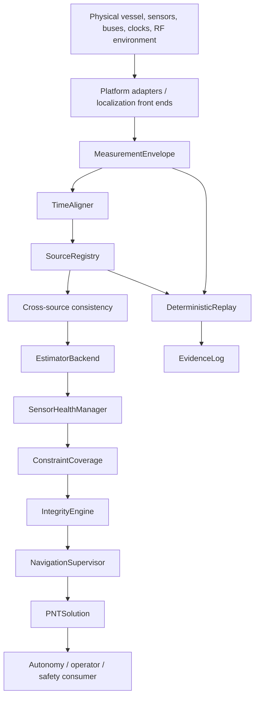

# AMEP Engineering Wiki

**Adaptive Maritime Estimation and PNT (AMEP-1)** is a SALT19 research and engineering project for resilient multisensor maritime navigation and navigation-authority supervision under GNSS-degraded and GNSS-denied conditions.

**Project:** SALT19  
**Full-stack architect:** Gabriel V. Allit  
**AMEP-1 researcher / Version 1.0 author:** Gabriel V. Allit  
**Research record:** [Zenodo DOI 10.5281/zenodo.22561851](https://doi.org/10.5281/zenodo.22561851)

> **Maturity boundary:** AMEP is research software / a software-in-the-loop prototype. This wiki is production-quality engineering documentation; it does **not** reclassify the software as production-grade, certified PNT, or validated vessel-control software.

## Purpose of this wiki

AMEP crosses traditional engineering boundaries. A navigation engineer sees state estimation and integrity. A mechanical or naval engineer sees sensor mounting, lever arms, vessel motion, and hydrodynamic assumptions. An electrical engineer sees power, clocks, grounding, sensor interfaces, and common-cause failure domains. A communications engineer sees timing, RF health, transport latency, link freshness, and GNSS denial. A software engineer sees typed interfaces, deterministic replay, configuration identity, fault containment, and evidence. A safety or test engineer sees requirements, failure modes, authority transitions, and proof gaps.

This wiki is organized so each discipline can identify:

1. what AMEP consumes from that discipline;
2. what AMEP produces for that discipline;
3. which assumptions cross the interface;
4. what failures AMEP can currently detect or contain;
5. what evidence is still required before operational use.

## Start from your engineering lens

| Discipline | Read first | Primary AMEP concern |
| --- | --- | --- |
| Systems / chief engineer | [System Architecture](01-System-Architecture.md) | boundaries, interfaces, requirements, evidence |
| Mechanical / naval architecture | [Discipline Views](02-Discipline-Views.md#mechanical--naval-architecture) | mounting, lever arms, motion, environment, physical SAFE_HOLD |
| Electrical / electronics | [Discipline Views](02-Discipline-Views.md#electrical--electronics--power) | power domains, clocks, wiring, EMC/EMI, common-cause faults |
| Navigation / PNT / sensor fusion | [Estimation, Integrity, and Authority](04-Estimation-Integrity-Authority.md) | state, covariance, NIS, source dependence, integrity |
| Communications / RF | [Timing, Communications, and Failure Domains](05-Timing-Comms-Failure-Domains.md) | timing, RF health, latency, link freshness, jam/spoof context |
| Embedded / real-time | [Integration and Production Gates](07-Integration-Production-Gates.md) | WCET, jitter, watchdog, target compute, resource margins |
| Controls / autonomy | [Estimation, Integrity, and Authority](04-Estimation-Integrity-Authority.md#navigation-modes-and-authority) | mode authorization, degraded navigation, SAFE_HOLD contract |
| Software / platform | [Interfaces and Data Contracts](03-Interfaces-Data-Contracts.md) | adapters, schemas, replay, configuration, backend seams |
| Verification / test | [Verification and Evidence](06-Verification-Evidence.md) | evidence ladder, regression, replay, HIL, water trial |
| Safety / assurance / review | [Design Review Checklist](08-Design-Review-Checklist.md) | failure hypotheses, claim boundaries, gate closure |

## The AMEP mental model

AMEP is not "an EKF with extra sensors." It is an architecture that keeps navigation information, timing, source identity, dependencies, health, integrity, authority, and evidence visible through the stack.



The architecture deliberately separates several questions that are often collapsed into one:

- **Is the sensor fresh?** Health question.
- **Is the measurement statistically compatible with the estimator?** Innovation-consistency question.
- **Does another supposedly independent source agree?** Cross-source consistency question.
- **Are the agreeing sources actually independent enough to earn safety credit?** Dependency / integrity question.
- **Is enough trustworthy navigation information available to authorize the requested operating mode?** Navigation-authority question.
- **Can the result be reproduced with the same software and configuration?** Evidence question.

## What the current reference implementation contains

The present maritime estimator uses the seven-state horizontal reference model:

```text
x = [E, N, Vw_E, Vw_N, C_E, C_N, psi]^T
```

where `E,N` are local horizontal position, `Vw` is water-relative velocity, `C` is estimated current, and `psi` is heading. Ground velocity is the vector sum `Vg = Vw + C`.

Around that estimator, the repository implements explicit contracts for measurement envelopes, clock normalization, source registration and dependency declarations, cross-source consistency, sensor health, constraint coverage, integrity state, navigation authority, PNT output, deterministic replay, and software evidence.

The estimator interface is replaceable. A production-facing vessel integration would normally add a calibrated inertial mechanization / ESKF or other appropriate backend rather than treating the seven-state research filter as a full strapdown INS.

## What AMEP deliberately does not claim

AMEP does not currently establish:

- certified PNT integrity or a validated protection level;
- production strapdown inertial navigation;
- real-vessel bus or sensor conformance;
- field performance against sophisticated jamming or spoofing;
- target-hardware real-time determinism;
- collision avoidance, COLREGs, route compliance, or under-keel-clearance logic;
- physical station keeping or propulsion behavior for `SAFE_HOLD`;
- HIL or controlled-water validation sufficient for deployment;
- regulatory or type-approval compliance.

This distinction is intentional. The Version 1.0 research record retained negative results: clean same-sensor performance did not show meaningful superiority, and correlated common-mode position bias defeated the original covariance-based integrity interpretation.

## Wiki map

1. [System Architecture](01-System-Architecture.md) — system context, boundaries, layers, physical/software split.
2. [Discipline Views](02-Discipline-Views.md) — AMEP translated into mechanical, electrical, RF, controls, software, test, and safety concerns.
3. [Interfaces and Data Contracts](03-Interfaces-Data-Contracts.md) — measurements, frames, clocks, source registry, estimator and solution contracts.
4. [Estimation, Integrity, and Authority](04-Estimation-Integrity-Authority.md) — estimator model, health versus integrity, mode logic, protection-bound boundary.
5. [Timing, Communications, and Failure Domains](05-Timing-Comms-Failure-Domains.md) — temporal integrity, receive order, RF/link supervision, common-cause modeling.
6. [Verification and Evidence](06-Verification-Evidence.md) — evidence ladder, CI, replay, fault injection, external review package.
7. [Integration and Production Gates](07-Integration-Production-Gates.md) — platform onboarding and the evidence required before operational claims.
8. [Design Review Checklist](08-Design-Review-Checklist.md) — multidisciplinary review gates and interface questions.
9. [Glossary, Ownership, and Citation](09-Glossary-Ownership-Citation.md) — terminology, project identity, research citation, claim hierarchy.

## Normative source hierarchy

When documents disagree, use this order:

1. executable source and tests for current software behavior;
2. current repository architecture / hardening documentation for integration contracts;
3. frozen AMEP-1 Version 1.0 research record for historical research claims and results;
4. this wiki as the cross-disciplinary engineering explanation.

The wiki must not silently upgrade evidence. A software contract is not a vessel result; a SIL result is not HIL; HIL is not a water trial; a covariance radius is not a protection level.

## Canonical research citation

> Allit, G. (2026). *Adaptive Maritime Estimation and PNT (AMEP-1): A Falsifiable Resilient Multisensor Navigation and Autonomy-Authority Architecture for GNSS-Degraded USV Operation* (Version 1.0). Zenodo. https://doi.org/10.5281/zenodo.22561851

For repository-specific citation metadata, see [`CITATION.cff`](../../CITATION.cff).
